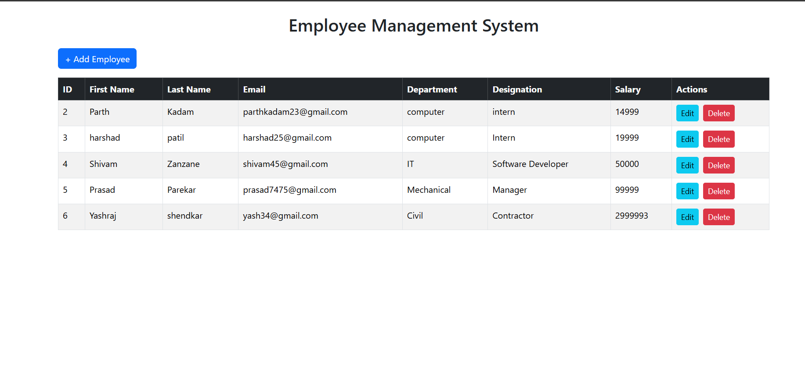
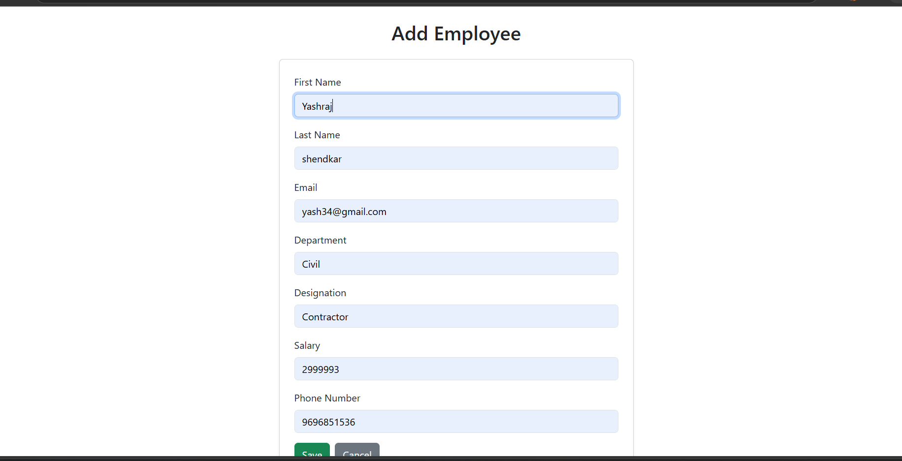
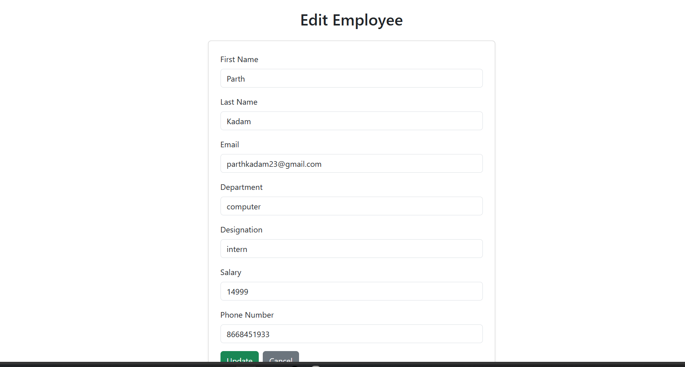

\# Employee Management System

A full-stack \*\*Employee Management System\*\* built with \*\*Spring Boot\*\* (backend) and \*\*React\*\* (frontend), backed by \*\*MySQL\*\*.

!\[Java](https://img.shields.io/badge/Java-17-orange)

!\[Spring Boot](https://img.shields.io/badge/Spring%20Boot-3.x-brightgreen)

!\[React](https://img.shields.io/badge/React-18-blue)

!\[MySQL](https://img.shields.io/badge/MySQL-8-blue)

\## ✨ Features

## 📸 Screenshots

### Employee List

### Add Employee

### Edit Employee

\- ✅ Add, view, update, and delete employees

\- ✅ Server-side validation with `@Valid`

\- ✅ Global exception handling

\- ✅ RESTful API with proper HTTP status codes

\- ✅ Responsive Bootstrap UI

\- ✅ CORS-enabled backend

\## 🏗️ Tech Stack

\*\*Backend:\*\* Java, Spring Boot, Spring Data JPA, Hibernate, MySQL, Maven  

\*\*Frontend:\*\* React, React Router, Axios, Bootstrap 5  

\*\*Database:\*\* MySQL 8

\## 📁 Project Structure

